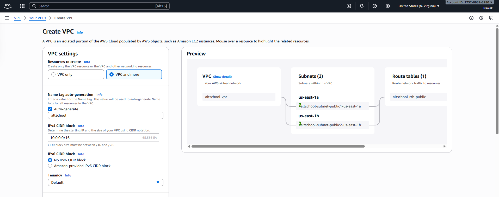
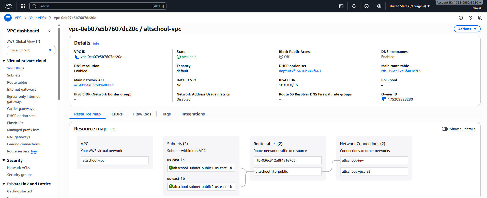
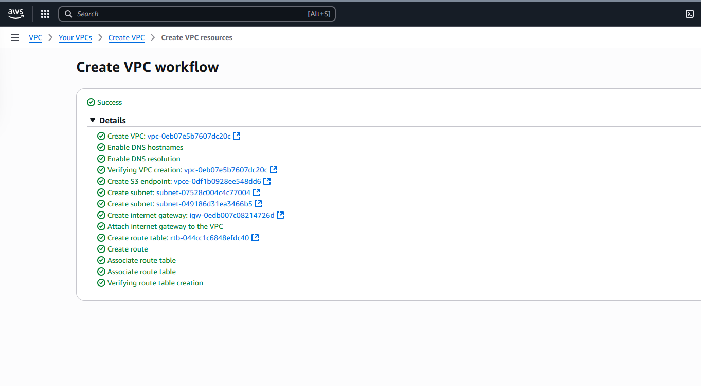
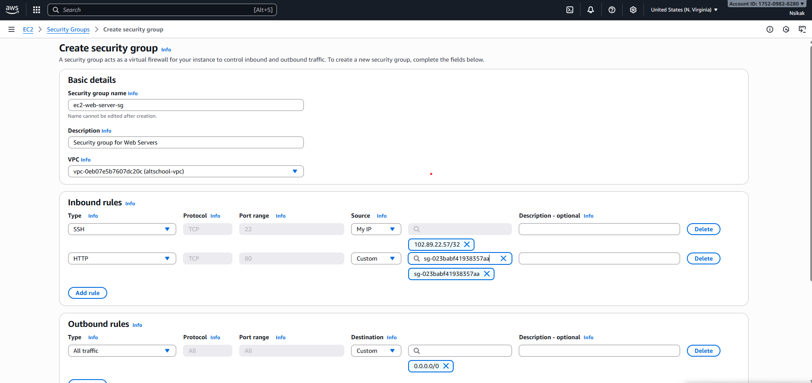
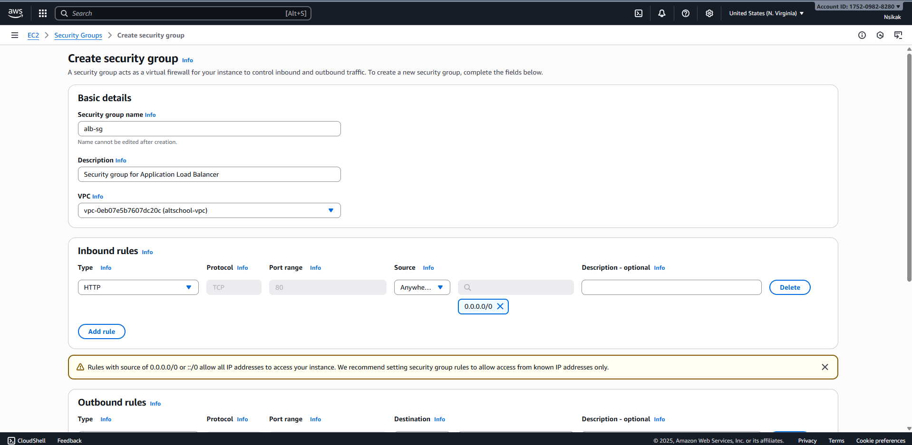
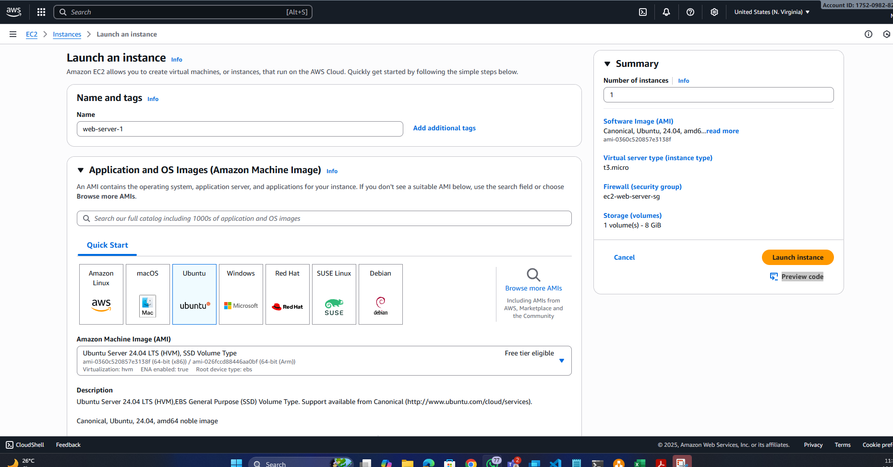
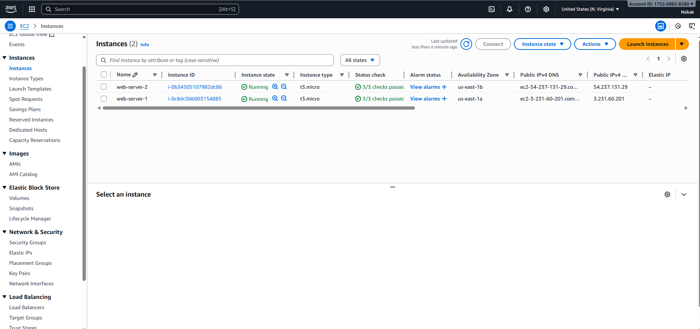
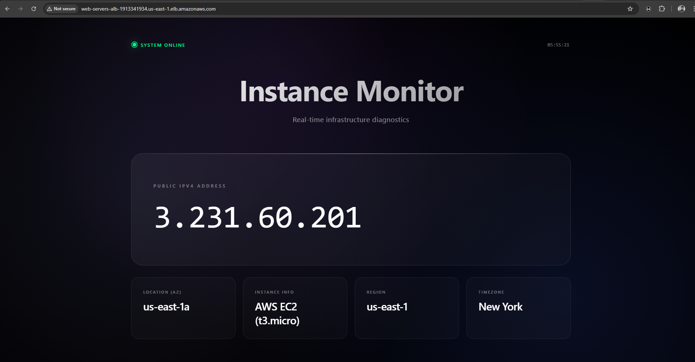
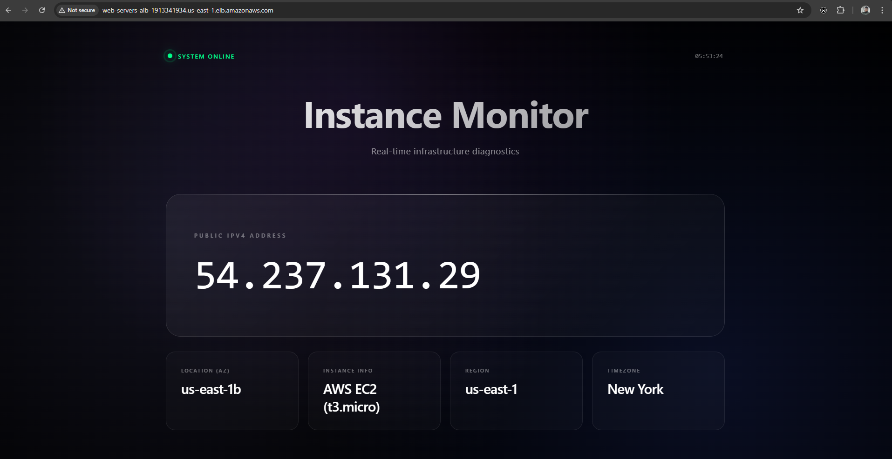

# 🌩️ From Cloud Novice to Production Infrastructure on AWS  
### How I Went from “What’s a VPC?” to Deploying My First Load-Balanced Application  

*By **Nsikak Ubom**, Technical Program Manager & Cloud Enthusiast*  
*Helping teams bridge technology and business through cloud-driven innovation.*

---

Six months ago, I couldn’t tell you the difference between a subnet and a security group.  
Today, I’m deploying automated, multi-server applications with load balancers — and actually *understanding why* each step matters.  

This is how I went from *“what’s a VPC?”* to *“hello, production infrastructure.”*

---

## 🧩 Step 1: Build the Network Foundation  

When I first started, the **Virtual Private Cloud (VPC)** sounded intimidating.  
Turns out, it’s just your **own private network inside AWS** — like a personal data center in the cloud.  

**Create a VPC:**
```
CIDR: 10.0.0.0/16
```


This gives you a private network with up to 65,536 IP addresses.

**Subnets (for high availability):**
```
Subnet A: 10.0.1.0/24 (us-east-1a)
Subnet B: 10.0.2.0/24 (us-east-1b)
```


Separate AZs (Availability Zones) mean resilience — if one data center fails, your app keeps running in the other.

Add an **Internet Gateway** for external access and create a route table:
```
Destination: 0.0.0.0/0  
Target: Internet Gateway
```


**Security Groups:**
- ALB SG: Allow HTTP (80) from anywhere  
- EC2 SG: Allow HTTP only from ALB SG, and SSH (22) only from your IP





> 💡 **Tip:** Security Groups act like your firewall.  
> They decide who can “knock” on your servers — and how.

---

## 🖥️ Step 2: Launch EC2 Instances  

Once your network is ready, launch two servers (EC2 instances), one per subnet.  

**Recommended configuration:**
- Type: `t2.micro` (Free Tier)
- OS: Ubuntu 24.04 LTS
- Count: 2 (one per subnet)
- Storage: 8GB gp3
  


> ⚙️ Enable “Auto-assign public IP” temporarily for setup.  

Now you’ve got two servers in different zones — a simple yet resilient architecture.  

> 💬 *Each EC2 instance is a virtual machine. Splitting them across zones helps your app survive outages.*



---

## ⚙️ Step 3: Automate Setup with Ansible  

Manually configuring servers gets old fast.  
**Ansible** automates this with playbooks that ensure consistent setup every time.  

**Inventory file (`inventory.ini`):**
```
[webservers]
web1 ansible_host=<ip1> ansible_user=ec2-user ansible_ssh_private_key_file=my-key.pem
web2 ansible_host=<ip2> ansible_user=ec2-user ansible_ssh_private_key_file=my-key.pem
```
**Inventory file - Dry test:**
```
ansible -i inventory.ini webservers -m ping
```
>Output:
```
web-server-1 | SUCCESS => {
    "ansible_facts": {
        "discovered_interpreter_python": "/usr/bin/python3"
    },
    "changed": false,
    "ping": "pong"
}
web-server-2 | SUCCESS => {
    "ansible_facts": {
        "discovered_interpreter_python": "/usr/bin/python3"
    },
    "changed": false,
    "ping": "pong"
}
```
**Playbook (`deploy-website.yml`):**
```yaml
---
- name: Deploy Web Server with NGINX on Ubuntu EC2 Instances
  hosts: webservers
  become: yes
  become_method: sudo

  tasks:
    - name: Update all packages
      apt:
        name: '*'
        state: latest
        update_cache: yes

    - name: Update apt cache
      apt:
        update_cache: yes
        cache_valid_time: 3600

    - name: Install NGINX
      apt:
        name: nginx
        state: present

    - name: Ensure NGINX is enabled to start on boot
      systemd:
        name: nginx
        enabled: yes
```

**Run it:**
```bash
ansible-playbook -i inventory.ini deploy-website.yml
```
>Output:
```
PLAY [Deploy Web Server with NGINX and PHP on Ubuntu EC2 Instances] ************************************************************************************************************************

TASK [Gathering Facts] *********************************************************************************************************************************************************************
ok: [web-server-1]
ok: [web-server-2]

TASK [Update all packages] *****************************************************************************************************************************************************************
ok: [web-server-2]
ok: [web-server-1]

RUNNING HANDLER [restart nginx] ************************************************************************************************************************************************************
changed: [web-server-1]
changed: [web-server-2]

PLAY RECAP *********************************************************************************************************************************************************************************
web-server-1               : ok=27   changed=8    unreachable=0    failed=0    skipped=0    rescued=0    ignored=0
web-server-2               : ok=27   changed=8    unreachable=0    failed=0    skipped=0    rescued=0    ignored=0

```

> 💡 **Insight:** Ansible connects to your servers via SSH and runs all tasks simultaneously.  
> This is how professionals manage multiple environments — consistently and quickly.

---

## ⚖️ Step 4: Configure Load Balancing  

Next, set up an **Application Load Balancer (ALB)** to distribute traffic evenly between servers.  
If one instance fails, the other automatically takes over.

**Target Group:**
- Protocol: HTTP  
- Port: 80  
- Health Check Path: `/`

**ALB Setup:**
- Internet-facing  
- Mapped to both subnets  
- Security group allows HTTP (80)  
- Listener forwards traffic to Target Group  

AWS provides a DNS like:  
```
alb-xxxx.us-east-1.elb.amazonaws.com
```
Visit that link in your browser — refreshing the page alternates between your EC2 servers. 





> ✅ You’ve just built a **redundant, fault-tolerant web infrastructure**.  

> ⚠️ If one instance fails a health check, ALB automatically routes traffic to the healthy one.

---

## 💰 Step 5: Compare EC2 vs. S3 Hosting Costs  

After building this, I wanted to see how much it really costs.  
Turns out — static sites are far cheaper on **Amazon S3**.

| Feature | EC2 + ALB | S3 Static |
|----------|------------|------------|
| Compute | $16.50 | $0 |
| Load Balancing | $22.50 | $0 |
| Storage | Included | $0.023 |
| Requests | Included | $0.012 |
| Data Transfer | $0.90 | $0.90 |
| **Total** | **≈$43/mo** | **≈$1/mo** |

**When to choose:**
- **S3** → Static sites, landing pages, portfolios  
- **EC2** → APIs, authentication, or backend logic  

> 💡 *S3 is perfect for simple hosting — no servers to manage, and nearly free.*

---

## 🧰 Step 6: Common Issues (and Fixes)

| Issue | Fix |
|-------|-----|
| `Permission denied` (SSH/Ansible) | Run `chmod 400 my-key.pem` |
| ALB Health Checks failing | Allow EC2 SG to accept traffic only from ALB SG |
| Website unreachable | Ensure NGINX is running and port 80 is open |

> ⚠️ **Pro Tip:**  
> When something doesn’t work, check your security groups and routing first.  
> 80% of AWS issues live there.

---

## 🧹 Step 7: Cleanup to Avoid Surprise Bills  

Delete resources in this order:
1. Load Balancer  
2. Target Group  
3. EC2 Instances  
4. Internet Gateway  
5. Subnets & Route Tables  
6. VPC  

Set a billing alert at **$5/month** to avoid unexpected charges.

> 💡 *Cloud learning is great — cloud billing surprises are not.*

---

## 🚀 Final Thoughts  

This project gave me my first hands-on taste of **production-grade infrastructure** on AWS:  
- Redundant servers across availability zones  
- Secure networking  
- Automated configuration with Ansible  
- Fault-tolerant load balancing  

From here, you can enhance it with:
- HTTPS via AWS Certificate Manager  
- Auto Scaling for traffic spikes  
- CloudWatch for monitoring  
- CloudFront for faster delivery  

> 🧠 **Lesson:** Every cloud expert started by deploying something small — and learning from it.  
> Keep building. Keep breaking. Keep learning. 🌱

---

## ✍️ About the Author  

**Nsikak Ubom** is passionate about cloud architecture, DevOps, and bridging the gap between technology and business growth.  
He writes about practical cloud learning, automation, and digital innovation.

📬 *Follow Nsikak on Medium for more AWS and DevOps learning stories.*

---

❤️ Written with passion from Lagos, Nigeria  
🕊️ Published on [Medium](https://medium.com)  

**Tags:** `#AWS` `#DevOps` `#InfrastructureAsCode` `#CloudArchitecture` `#Ansible` `#LoadBalancing` `#VPC`


